# Rooting-Android

## Mise en place d’un environnement AVD avec privilèges root

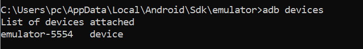
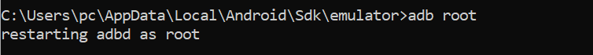
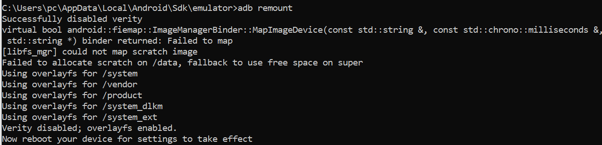

---

## Vérification des mécanismes d’intégrité

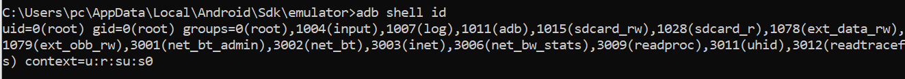

### Option permissive :

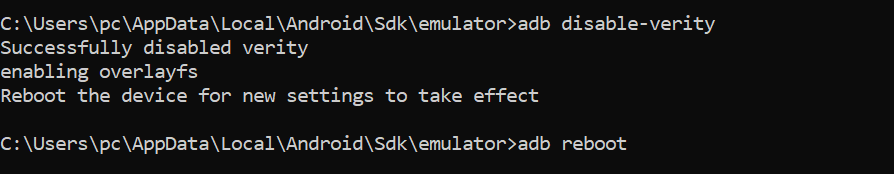

### Journalisation :

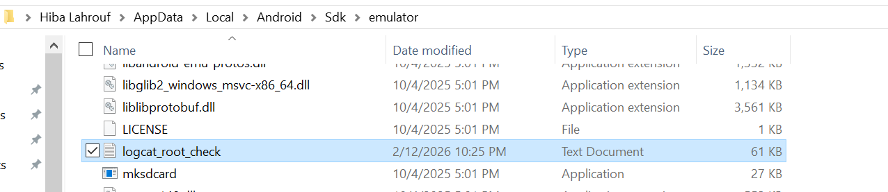
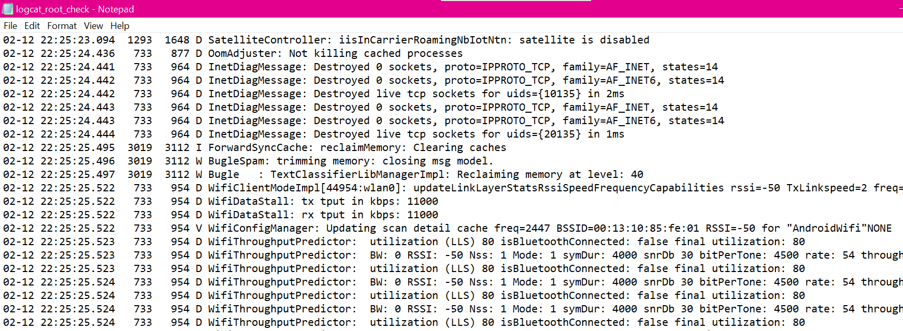

---

# Fiche Périmètre

**Application :** DIVA – version 1.0 (versionCode 1)  

**Support de test :** Android Virtual Device (AVD) – Android 6.0 (API 23)  

**Objectif :** Comprendre le mécanisme de rooting et analyser ses impacts sur les contrôles d’intégrité et l’accès aux données protégées  

**Nature des données :** Données fictives utilisées à des fins pédagogiques  

**Contexte réseau :** Réseau de test isolé (aucun environnement de production)  

---

## Initialisation d’un environnement AVD propre et contrôlé

- Aucun compte Google personnel n’est configuré  
- Aucune application résiduelle n’est installée  

### Vérification :

---

## Installation et validation de l’application de test

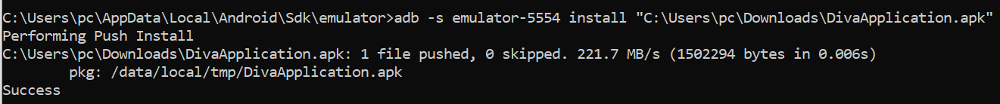

### Vérification de la version de l'application

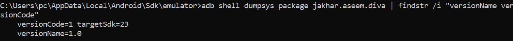

---

# Élaboration des parcours utilisateur de test

---

## Scénario 1 — Ouverture de l’écran d’accueil

### Objectif

Vérifier que l’application se lance correctement et affiche l’écran principal contenant la liste des modules.

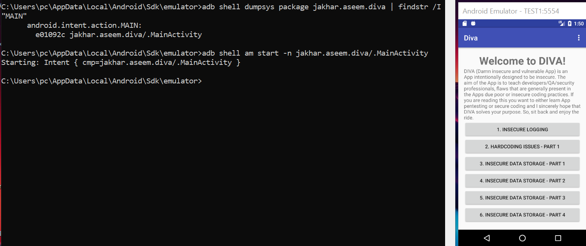

---

## Scénario 2 — Ouverture d’un écran “détail” (module)

### Objectif

Tester la navigation vers un écran secondaire (exp : insecure loggin).

**Button cliqué :** insecure loggin  

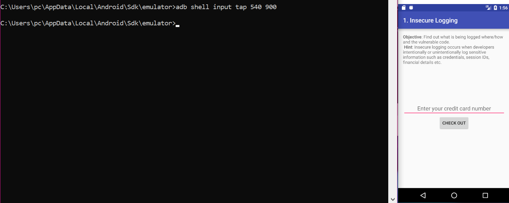

---

## Scénario 3 — Interaction utilisateur contrôlée

### Objectif

Réaliser une interaction simple, répétable et contrôlée dans le module sélectionné.

### Entrée utilisée (fixe) :4111111111111111

Numéro fictif utilisé exclusivement à des fins de test.

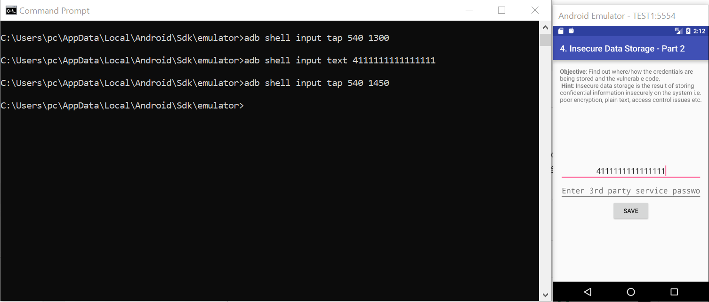

---

# Principes fondamentaux de la sécurité Android

Android protège le système grâce à plusieurs niveaux de sécurité.  
Chaque application fonctionne dans une sandbox, ce qui signifie qu’elle est isolée des autres applications. Ainsi, les données privées sont séparées et l’accès au système est limité.  

Android utilise aussi un modèle de permissions, où les applications doivent demander explicitement l’autorisation pour accéder aux ressources sensibles comme la caméra, les contacts ou le stockage.  

Le système assure également l’intégrité globale, afin d’empêcher toute modification non autorisée d’Android.  

Lorsque l’on root un appareil, certaines de ces protections peuvent être contournées.

---

# Verified Boot

Verified Boot est un mécanisme de sécurité qui contrôle l’intégrité du système au moment du démarrage.  
Son objectif principal est de s’assurer que le système qui démarre correspond bien à celui prévu par le fabricant et qu’il n’a pas été modifié de manière malveillante.

---

## Chain of trust

La chain of trust est une suite de vérifications successives où chaque élément vérifie le suivant avant de lui accorder sa confiance.  
Chaque étape dépend donc de la validation correcte de l’étape précédente.

---

## Pourquoi l'intégrité au démarrage est critique

L’intégrité au démarrage est essentielle car si cette phase est compromise, toutes les protections mises en place ensuite peuvent être contournées.

---

## Vérification

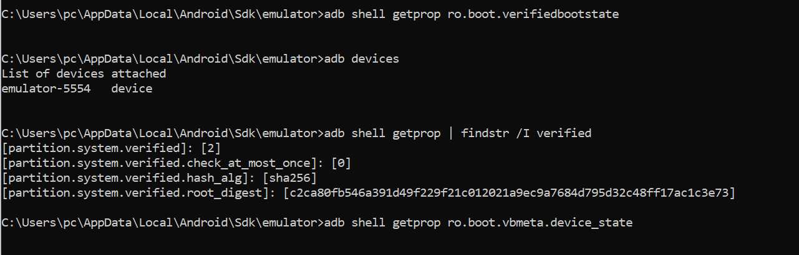

Sur l’AVD Android 6.0 (API 23), la propriété `ro.boot.verifiedbootstate` n’est pas disponible.  
Cependant, les propriétés `partition.system.verified` indiquent que le mécanisme **dm-verity** est actif et que la partition système est vérifiée via un algorithme **SHA-256**.  

Cela confirme que l’intégrité du système est maintenue au démarrage.

---
# Android Verified Boot (AVB)

Android Verified Boot (AVB) est une version plus moderne et plus flexible de Verified Boot.
Il renforce la vérification d’intégrité du système au démarrage et introduit des mécanismes de contrôle plus avancés.
AVB inclut également une protection contre le rollback, qui empêche l’installation d’anciennes versions du système pouvant contenir des vulnérabilités connues.
La protection anti-rollback évite qu’un attaquant remplace une version sécurisée du système par une version plus ancienne et moins protégée.

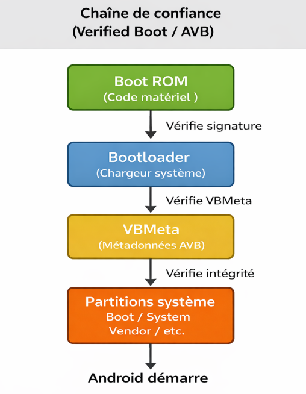

---
# Rooting
Le rooting correspond à l’obtention des privilèges super-utilisateur (root), permettant d’exécuter des actions normalement interdites à un utilisateur standard.
Sur Android, cela modifie les protections et la confiance du système, car certaines sécurités ne s’appliquent plus de la même manière.
En laboratoire, le root est utile pour observer des comportements internes et analyser plus en profondeur le fonctionnement du système.
Cependant, il reste risqué : il doit être utilisé dans un environnement isolé, documenté et réinitialisé après les tests afin de préserver la fiabilité des conclusions.

 ---

# Matrice de risques

- **Intégrité non garantie :**  
Un environnement rooté peut altérer le comportement normal du système et fausser les conclusions sur la sécurité réelle de l’application.

- **Surface d’attaque accrue :**  
Si l’appareil rooté quitte le laboratoire, il devient plus exposé aux menaces externes et aux attaques potentielles.

- **Exposition de données sensibles :**  
La présence de données réelles dans un environnement rooté peut entraîner une violation de la confidentialité.

- **Instabilité du système :**  
Les modifications liées au root peuvent provoquer des dysfonctionnements rendant les tests non reproductibles.

- **Mélange comptes personnels et test :**  
L’utilisation de comptes personnels dans un environnement de test peut conduire à une fuite involontaire d’informations privées.

- **Nettoyage insuffisant en fin de session :**  
L’absence de réinitialisation peut laisser persister des données sensibles ou des configurations modifiées.

- **Réseau non isolé :**  
Un appareil de test connecté à un réseau non contrôlé peut affecter ou exposer d’autres systèmes.

- **Traçabilité insuffisante :**  
Le manque de documentation des actions réalisées empêche la reproduction fiable et l’audit des tests effectués.

---

# Mesures défensives mises en place

**Réseau isolé :**  
L’environnement de test est connecté à un réseau dédié afin d’éviter toute communication non contrôlée avec des systèmes externes.

**Données fictives uniquement :**  
Seules des données de test non réelles sont utilisées pour éliminer tout risque de fuite d’informations sensibles.

**AVD dédié :**  
Un appareil virtuel est exclusivement réservé aux expérimentations de sécurité afin d’éviter toute contamination croisée.

**Snapshots ou réinitialisation :**  
Un snapshot ou un wipe est effectué en fin de séance pour supprimer toute modification ou donnée persistante.

**Journal de configuration :**  
Un enregistrement détaillé des paramètres et commandes utilisées est conservé pour garantir la reproductibilité des tests.

**Aucun compte personnel :**  
Aucun compte personnel n’est configuré sur l’environnement de test afin d’éviter le mélange de données privées.

**Contrôle des APK installées :**  
Seules les applications nécessaires aux tests sont installées afin de limiter la surface d’attaque.

**Horodatage et captures :**  
Chaque étape importante est documentée par des captures d’écran et horodatée pour assurer une traçabilité complète.

---

# Référence OWASP MASVS

L’OWASP MASVS (Mobile Application Security Verification Standard) est un standard permettant d’évaluer la sécurité des applications mobiles selon des exigences reconnues.

## MASVS-STORAGE-1

L’application doit stocker les données sensibles (mots de passe, clés API, tokens, etc.) de manière sécurisée.  
Cela signifie que ces informations doivent être protégées, par exemple grâce au chiffrement, afin d’éviter qu’elles soient accessibles ou lisibles par d’autres applications ou utilisateurs.

## MASVS-NETWORK-1

L’application doit sécuriser toutes ses communications réseau en utilisant des bonnes pratiques comme TLS.  
Les données échangées doivent être chiffrées et l’identité du serveur distant doit être vérifiée afin de garantir la confidentialité et l’intégrité des échanges.

---
# OWASP MASTG – Tests pratiques

---

## Test 1 – Insecure Data Storage

### Objectif

Vérifier si les données sensibles sont stockées de manière sécurisée dans l’application.

### Test

  
*Figure 1 – Message confirmant l’enregistrement des identifiants.*

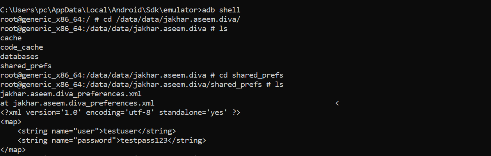  
*Figure 2 – Identifiants stockés en clair dans le fichier shared preferences.*

### Résultat

Les identifiants sont enregistrés en texte clair dans le fichier XML.

---

## Test 2 – Journalisation non sécurisée (Insecure Logging)

### Objectif

Vérifier si des données sensibles apparaissent dans les journaux système.

### Test

  
*Données sensibles visibles dans les journaux système.*

### Résultat

Les informations saisies apparaissent dans les logs système.

---

---

# Fiche Environnement – Traçabilité des tests

## Informations générales

**Date du test :** 12/02/2026  
**Auteur :** LAHROUF Hiba  
**Support utilisé :** Android Virtual Device (AVD)  
**Système hôte :** Windows 10 (10.0.19045)

---

## Configuration technique

**Version Android :** Android 6.0  
**API Level :** 23  
**Statut root :** Activé (uid=0)  
**Verified Boot state :** orange  
**Verity mode :** enforcing  

**Commande utilisée :**
adb shell id
adb shell getprop ro.boot.verifiedbootstate

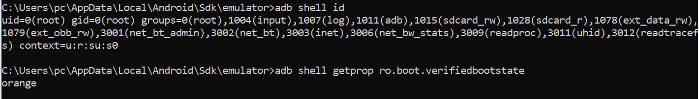

---

## Application testée

**Nom :** DIVA  
**Package :** jakhar.aseem.diva  
**Version :** 1.0 (versionCode 1)

---

## Scénarios réalisés

- Lancement de l’application (Home)  
- Ouverture du module Insecure Logging  
- Test de stockage des données (Insecure Data Storage)

---

## Observations factuelles

- Données stockées en clair dans shared_prefs  
- Informations sensibles visibles dans logcat  
- Accès root actif  
- Verified Boot state : orange  

---

## Limites

- Tests réalisés sur un environnement rooté  
- Résultats peuvent différer sur appareil non modifié  
- API 23 (mécanismes de sécurité anciens)

---

## Reset environnement

**Reset effectué :** Oui  
**Méthode :** Wipe AVD 
**Preuve :** 
Remise à zéro AVD
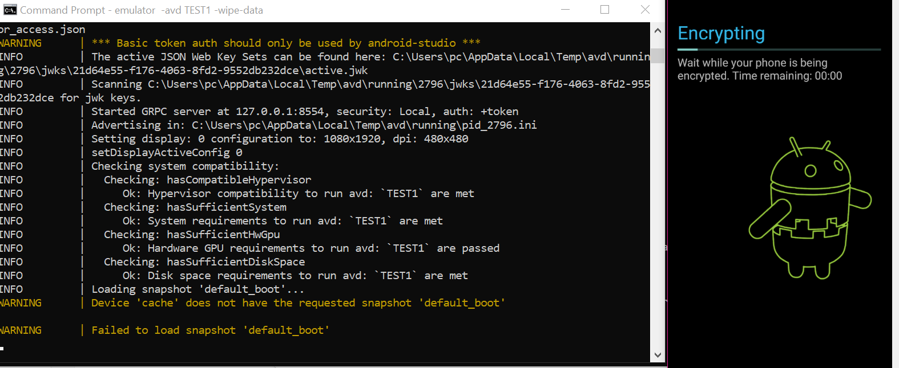  
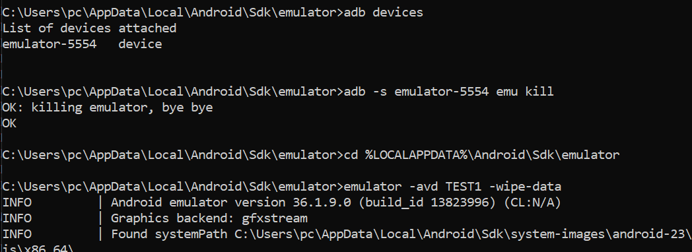  
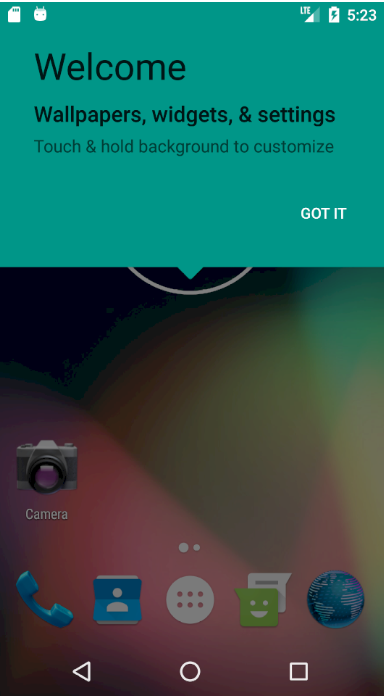  
